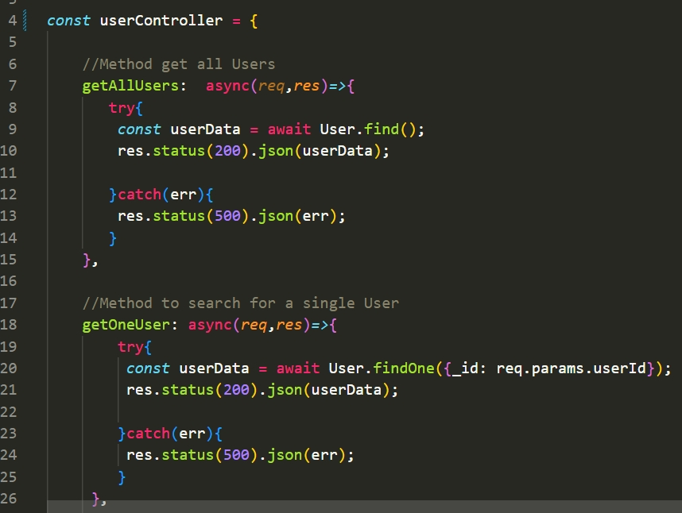
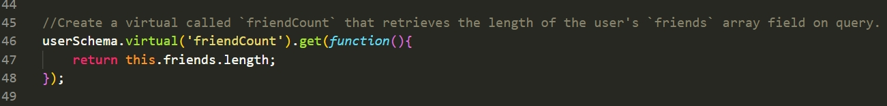

# API-For-Your-Social-Network

# About this API

This API was developed in Nodejs and allows you to save social network data in a NoSQL database. This API use MongoDB to save all your data and it also uses an ODM which is mongoose.

# Functionality
The API has 3 basic CRUD functionalities.

1- Create, Update and Delete a User.

* To create a user the user must provide a username and a valid email address.
* Users can add friends and have a list of friends, as well a record of all the friends that she or he has.
* User model has a reference to all Thoughts created by the same user.
* To update a user, you can update just your username or email as well. 

2- Create, Updated and Delete Thoughts.
* To create a Thought must provide the thoughtText, username and the userId.
* To update a Thought must provide the new thoughtText and that's it.

3- Add and Remove Reactions to other users thoughts.
* Each user can react to other users thoughts by adding a comment to that thought.
* Reaction schema will provide as well a record of how many users have reacted to one single thought.
    
# Technologies
was developed in Nodejs using a MVC arquitecture Pattern and using Express for routing. 

# Code 

UserController has all methods that I used in routes.
;

Virtuals are not stored in MongoDB, so you'll save precious memory in your DataBase!

# Link to video:
In the video you'll able to see the CRUD functionality using insomnia for testing all routes.

<a href="" target="_blank">Go to video</a>

